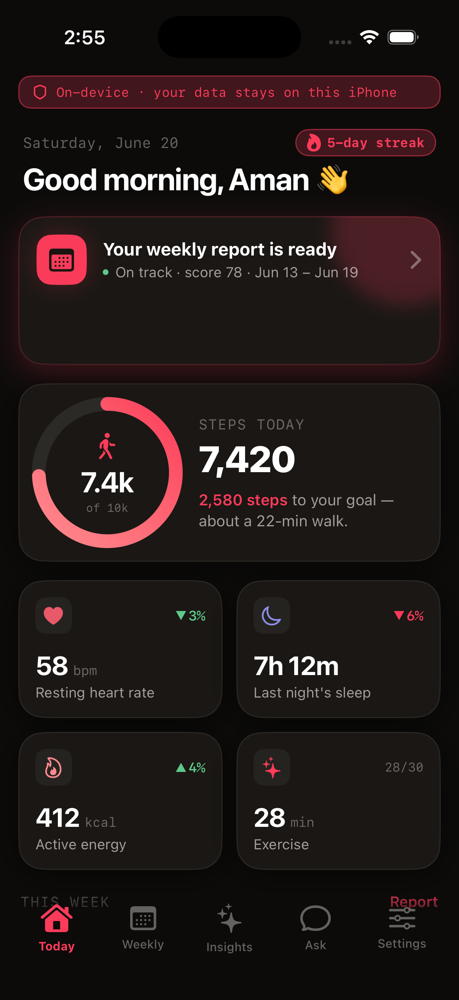
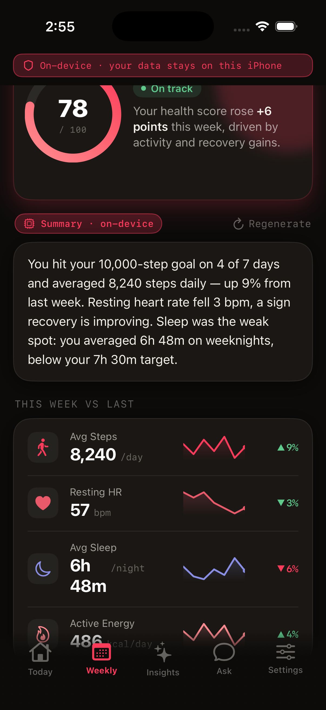
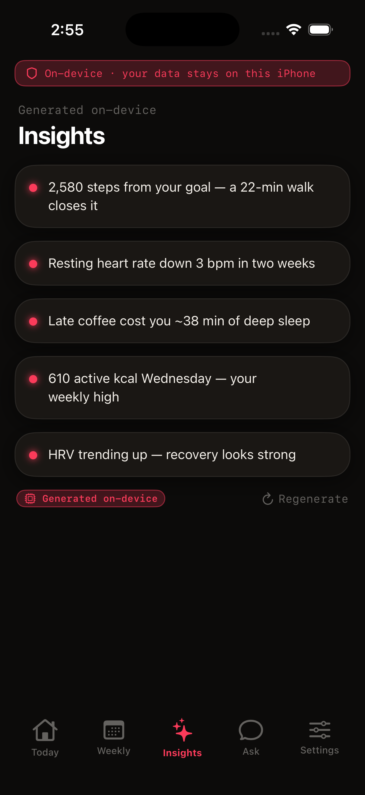
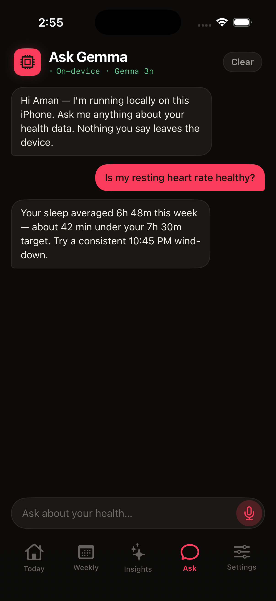
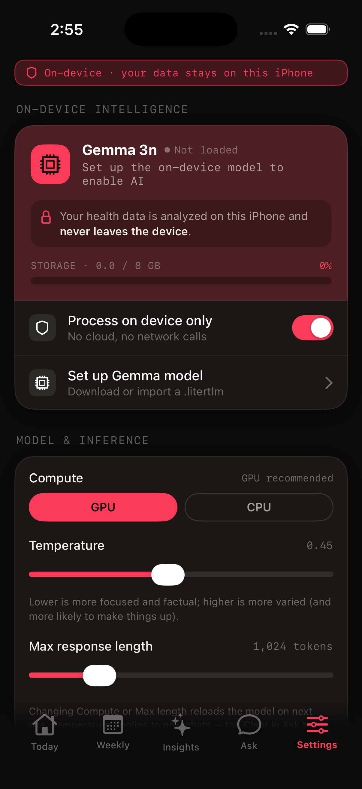

# Ember

**Private health intelligence for iPhone.**

Ember reads your Apple Health data and turns it into actionable insights, daily recommendations, weekly health summaries, and natural-language conversations — all powered by a **Gemma 3n** model running **entirely on-device**.

🔒 **100% private** • 📱 **Runs locally on your iPhone** • ❤️ **Apple Health integration** • 🎙️ **Voice-enabled assistant** • ☁️ **No cloud required**

No accounts. No subscriptions. No health data leaves your device.

A native SwiftUI application inspired by a high-fidelity design prototype, connected to real **HealthKit** data and a **Gemma-ready** on-device AI stack. Designed with a premium warm dark theme optimized for daily use.

<p>
  <em>Today · Weekly · Insights · Ask · Settings — plus Onboarding and a reusable metric Detail view.</em>
</p>

## Screenshots

<p align="center">
  
  
  
  
  
</p>

<p align="center">
  <sub>Today • Weekly Report • Insights • Ask Ember • Settings</sub>
</p>

---

## Features

### Daily Health Briefing

Get a concise daily summary of your health metrics, trends, and recommended actions based on your Apple Health data.

### Weekly Health Reports

Track progress over time with automatically generated weekly reports covering activity, recovery, sleep, and other key metrics.

### Health Insights

Dive deeper into trends and individual health metrics through reusable drill-down views and detailed visualizations.

### AI Health Assistant

Ask questions about your health data using natural language. The assistant can explain trends, summarize metrics, and provide context-aware guidance.

### Voice Interaction

Speak naturally to Ember using on-device speech recognition and conversational AI.

### Privacy First

All processing happens locally on your device. No cloud inference, external APIs, analytics pipelines, or user accounts.

---

## Requirements

- **Xcode 16 or later** (built and verified against Xcode 26.5, iOS 26.5 simulator SDK)
- **iOS 17.0+**
- iPhone only (portrait orientation)
- macOS with Xcode installed

A free Apple ID is sufficient to run Ember on your personal device.

---

## Quick Start (Simulator)

```bash
open Ember.xcodeproj

# or

xcodebuild -project Ember.xcodeproj -scheme Ember \
  -sdk iphonesimulator \
  -destination 'generic/platform=iOS Simulator' \
  CODE_SIGNING_ALLOWED=NO build
```

If `xcodebuild` cannot find the iOS SDK, Xcode may not be selected as the active developer directory:

```bash
sudo xcode-select -s /Applications/Xcode.app
```

or

```bash
DEVELOPER_DIR=/Applications/Xcode.app/Contents/Developer xcodebuild ...
```

The simulator runs entirely on mock data, allowing every screen to be explored without HealthKit permissions or AI model setup.

---

## Running on a Physical iPhone

iOS applications must be code-signed through Xcode before installation.

1. Open `Ember.xcodeproj`
2. Select the **Ember** target
3. Navigate to **Signing & Capabilities**
4. Set **Team** to your Apple ID
5. Change the bundle identifier if required
6. Connect your iPhone
7. Enable **Developer Mode**
8. Select your device as the run destination
9. Press **Run**

On first launch, Ember will request HealthKit permissions. Once granted, dashboards automatically populate with your own Apple Health data.

---

## Enabling Real On-Device Gemma 3n

The application uses the `LLMProviding` abstraction layer.

Default configuration:

```text
MockGemmaProvider
```

When MediaPipe is available and a compatible model is detected:

```text
MediaPipeGemmaProvider
```

is automatically selected.

No source-code modifications are required.

### 1. Install MediaPipe

```bash
brew install cocoapods
pod install
open Ember.xcworkspace
```

After installing CocoaPods, always open:

```text
Ember.xcworkspace
```

instead of:

```text
Ember.xcodeproj
```

### 2. Add a Gemma 3n Model

Obtain a quantized Gemma 3n `.task` model file.

Supported locations:

- App bundle
- Documents directory
- Documents/Models directory

Options include:

- Copying via the Files app
- Bundling directly into the application
- Downloading during first launch

> Ember cannot access models stored inside other applications' sandboxes, including AI Edge Gallery.

### 3. Run on a Physical Device

MediaPipe LLM inference is not supported on the iOS simulator.

When Ember detects a compatible `.task` model, it automatically switches from the mock provider to the real Gemma implementation.

Model files are excluded from Git:

```gitignore
*.task
```

---

## Architecture

SwiftUI · iOS 17 · `@Observable` state · protocol-based dependency injection

The project supports both mock and real service implementations, enabling full simulator functionality while maintaining production-ready integrations for physical devices.

```text
Ember/
  App/
  DesignSystem/
    Components/
  Models/
  Services/
  Features/
  Resources/

docs/
scripts/
```

### Service Layer

```text
HealthDataProviding
 ├─ HealthKitProvider
 └─ MockHealthProvider

LLMProviding
 ├─ MediaPipeGemmaProvider
 └─ MockGemmaProvider

SpeechTranscribing
 ├─ SpeechProvider
 └─ MockSpeechProvider
```

---

## Theming

Ember includes four built-in accent themes:

- Rouge (Default)
- Amber
- Iris
- Mint

Users can customize:

- Accent color
- Card style
- Corner radius
- Motion preferences

All appearance settings are available from:

```text
Settings → Appearance
```

---

## Privacy & Permissions

### HealthKit

Used for read-only access to Apple Health data.

### Microphone

Used for voice-based interaction.

### Speech Recognition

Used for on-device transcription.

### AI Inference

All language model inference runs locally on the device.

No health data is transmitted to external servers.

---

## Notes

### File-System-Synchronized Project

New files added under `Ember/` are automatically detected by Xcode without manual project edits.

### Regenerate App Icon

```bash
swift scripts/make_appicon.swift \
Ember/Resources/Assets.xcassets/AppIcon.appiconset/AppIcon.png
```

### Debug Deep Links

Launch directly into a specific screen:

```bash
xcrun simctl launch booted com.ember.health -ember.debugTab weekly
```

or

```bash
xcrun simctl launch booted com.ember.health -ember.debugDetail hr
```

Available only in Debug builds.

---

## Roadmap

- [ ] Advanced trend forecasting
- [ ] Personalized health goals
- [ ] Health anomaly detection
- [ ] Fine-tuned health-specific Gemma model
- [ ] Apple Watch companion
- [ ] Exportable health reports

---

## Credits

Built from a high-fidelity design handoff located in `docs/`.

Product name: **Ember**

Some prototype assets and source references may still use the internal codename **Vesta**.